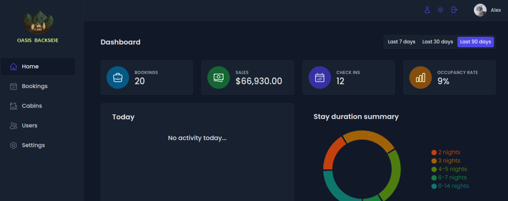
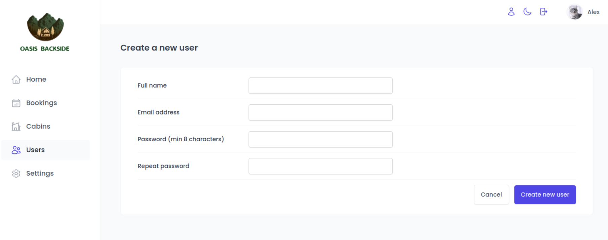
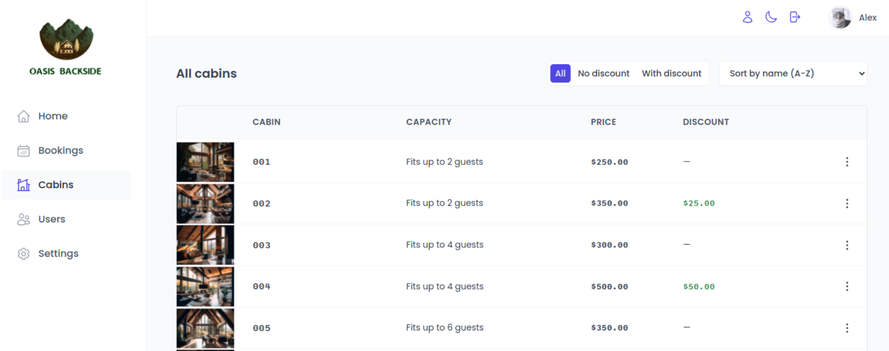
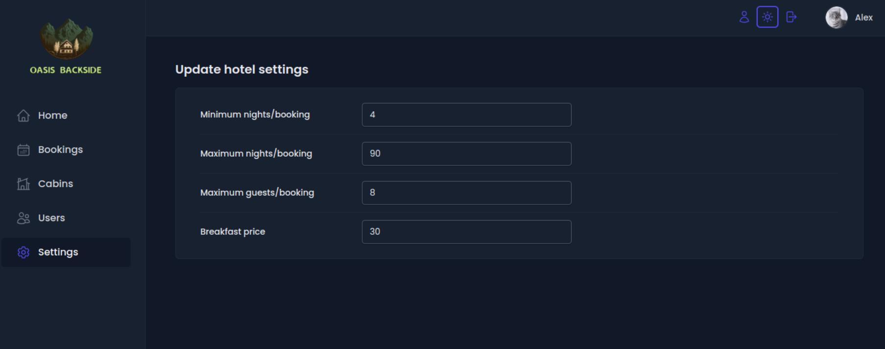

# Oasis Backside

Oasis Backside is the internal application used inside the hotel to manage bookings, rooms and guests.

## Features of App

- New users can only be sighed up inside the application to garantee that only actual hotel employees can get accounts
- There is a table with all rooms information (name, photo, price, capacity, discount). User can create, update and delete rooms.
- There is a table with all bookings, showing arrival and departure dates, status, and paid amount. User can delete, check in, or check out a bookings.
- There is a dashboard with important information for the last 7, 30,90 days (list of guest, statistics on bookings, sales, check ins, and occupacy rate)
- User can define a few application-wide settings: breakfast price, min and max nights/bookings, max guests/booking

## Tech Stack

- React
- React Router
- React Query
- React Hook Form
- Supabase
- Styled Components
- Vite

### Short demovideo


### Pages






## Setup

Install dependencies and run app

```sh
npm install
npm run dev
```
